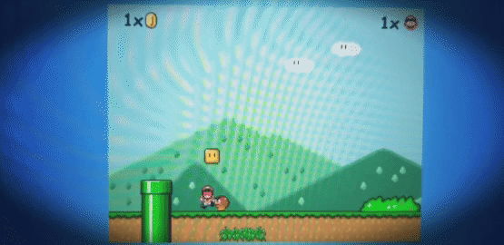

# Portfolio

<https://daniblaney.github.io/>

## Description

Here I have created a personal web page to show off my work in Rutgers Coding Bootcamp thus far. There is a About, Portfolio, and Contact page linked to Firebase. At the top right I have also linked my github page and my resume. The final icon in the top right is a game controller icon which directs to a mini Super Mario game.

## Bonus Game

### Game written by:

* FLORIAN RAPPL, 2012.
* florian-rappl.de
* mail@florian-rappl.de
* *****

